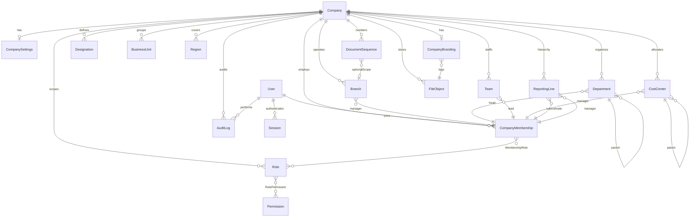
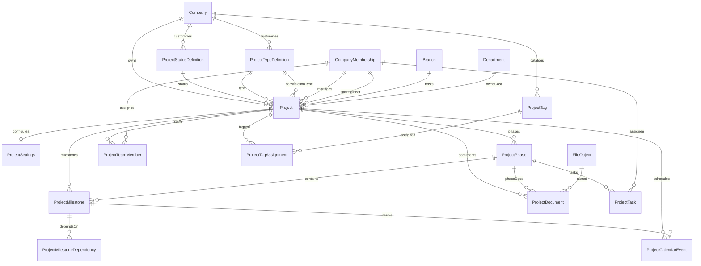

# ERP ER Diagram

## Company & Organization

## Project Lifecycle

## Isolation invariants

- Membership and org FKs are composite on `(entityId, companyId)`
- Project child FKs are composite on `(projectId|phaseId|milestoneId, companyId)`
- Soft-deleted legal numbers and project codes can be reused through partial unique indexes
- Platform administrators may operate without a company context; tenant users may not
- Future BOQ/Procurement/Inventory rows must include `(companyId, projectId)` from day one
