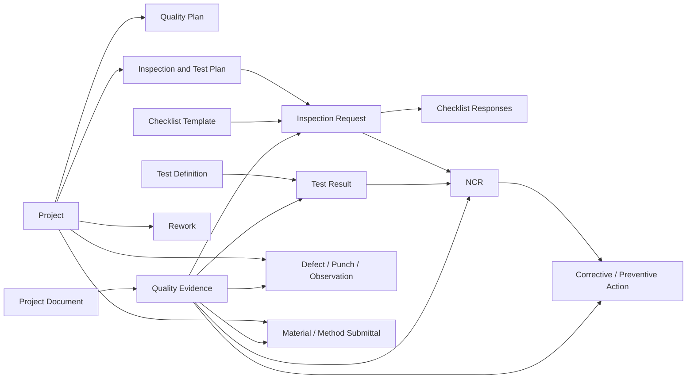

# QA/QC Quality Management

## Scope and architecture

The QA/QC module is a multi-tenant project subdomain. Every operational record carries `companyId` and `projectId`; repository queries always scope both values. It reuses the existing `Project`, `ProjectWbs`, `ProjectTask`, `CompanyMembership`, `ProjectDocument`, authorization guard, audit service, global error contract, and request context.

The repository does not currently contain Site, Area, BOQ, Inventory, Purchase Order, Goods Receipt, Vendor, Subcontractor, Workflow, Android, or real Notification/Event Bus implementations. The schema therefore retains non-FK traceability references for those future modules and does not create duplicate master data. WBS, activity, project, and DMS evidence use real foreign keys now.

## Quality lifecycle

1. Configure company/project standards, test definitions, and checklist templates.
2. Create and approve a versioned Project Quality Plan.
3. Create versioned ITP rows linked to WBS/activity with Hold, Witness, Review, or no control point.
4. Submit and schedule inspection requests; complete required checklist responses and attach existing project documents as evidence.
5. Record test results. Numeric results are compared automatically against configured minimum and maximum values.
6. Failed inspections/tests may originate an NCR. NCR closure requires verification and verified/closed corrective actions.
7. Track defects, punch items, observations, preventive actions, rework quantities, and rework costs.
8. Publish durable outbox events and auditable changes for downstream workflow/notification integration.

Approved plans, approved ITPs, and approved/superseded submittals are immutable. A new version/revision is required.

## Hold Point enforcement

When schedule progress attempts to set an activity to 100%, `PlanningService` invokes `QualityService.assertActivityHoldPointsResolved`. Any linked Hold Point inspection that is not Passed, Passed with Comments, or Closed blocks activity completion with a business-rule error. This enforcement is server-side and cannot be bypassed by the web client.

## Inspection workflow

`DRAFT → SUBMITTED → SCHEDULED → IN_INSPECTION → PASSED | PASSED_WITH_COMMENTS | REJECTED | REINSPECTION_REQUIRED → CLOSED`

Cancelled is terminal. Required checklist questions must be answered before an outcome. An inspection cannot pass while submitted responses contain a non-compliant item. Terminal outcomes cannot silently change.

Offline inspection submissions use `clientMutationId` for deduplication and `syncVersion` for optimistic conflict detection. A repeated mutation returns the original record; a stale version returns a conflict requiring refresh and user resolution.

## Numeric tests and overrides

For numeric test definitions:

- `minValue <= result <= maxValue` is Pass.
- Missing bounds are treated as open-ended.
- A failure is saved as Fail automatically.
- Client input cannot set the calculated or effective status.
- Overrides require `Quality.Test.Approve`, a reason, actor, and timestamp, and generate an audit/event record. The original calculated status remains preserved.

## NCR and action workflow

`CREATED → ASSIGNED → ROOT_CAUSE_ANALYSIS → CORRECTIVE_ACTION → IMPLEMENTATION → VERIFICATION → ACCEPTED → CLOSED`

The module supports 5 Why, Fishbone, and custom RCA labels without hardcoding algorithms. Corrective and preventive actions share the same effective-dated action record with an `actionType`. Closing requires NCR verification and every active action to be Verified or Closed.

## Material and method submittals

One versioned `QualitySubmittal` aggregate handles Material and Method Statement workflows while preserving type-specific fields. Material submittals require material/specification references. Method statements require method and quality requirements. The review states are Draft, Submitted, QA Review, Technical Review, Consultant Review, Client Review, Approved, Rejected, Revise/Resubmit, and Superseded.

Documents, certificates, technical data, MSDS, samples, drawings, signatures, and reports remain `ProjectDocument` records linked through `QualityEvidence`.

## API

Base: `/api/v1/companies/{companyId}/projects/{projectId}/quality`

| Resource | Endpoints |
|---|---|
| Dashboard | `GET /dashboard` |
| Standards | `GET, POST /standards` |
| Quality plans | `GET, POST /plans`, `PATCH /plans/{id}` |
| ITPs | `GET, POST /itps`, `PATCH /itps/{id}` |
| Checklists | `GET, POST /checklists` |
| Inspections | `GET, POST /inspections`, `GET /inspections/{id}`, `PATCH /inspections/{id}/outcome` |
| Test definitions/results | `GET, POST /test-definitions`, `GET, POST /test-results`, `POST /test-results/{id}/override` |
| NCR/actions | `GET, POST /ncrs`, `PATCH /ncrs/{id}`, `POST /ncrs/{id}/actions`, `PATCH /actions/{id}` |
| Defect/punch/observations | `GET, POST /issues`, `PATCH /issues/{id}` |
| Rework | `GET, POST /rework` |
| Material/method submittals | `GET, POST /submittals`, `PATCH /submittals/{id}` |
| Samples | `GET, POST /samples` |
| Evidence | `POST /evidence` |

Registers are paginated and backed by compound project/status/date indexes. Swagger derives request validation from DTOs.

## Permissions

The complete requested permission catalog is seeded, including general View/Create/Edit/Delete/Inspect/Approve/Reject/Submit, NCR Create/Edit/Assign/Close, Test Create/Approve, Material and Method Statement approval, Defect and Punch List Create/Close, Report, Export, and External Review.

- Company Admin and Super Admin receive the complete catalog.
- QA/QC Manager receives all Quality permissions plus project visibility.
- QA/QC Engineer receives operational creation, inspection, NCR, test, defect, punch, and reporting permissions.
- Project Manager receives quality planning/review/reporting permissions.
- Site Engineer receives inspection and field-record creation permissions.

All authorization is enforced by the existing server guard. Route company scope must match the authenticated membership unless the actor is a platform administrator.

## Audit and events

Every creation, status transition, inspection outcome, approval/rejection, test override, verification, closure, and evidence link is recorded through the existing transaction-aware audit service with actor, tenant, request ID, IP, and user agent.

Events are written to `quality_outbox_events` for a future dispatcher. Supported names include QualityPlanCreated, ITPCreated, InspectionRequestCreated, InspectionCompleted/Passed/Failed, TestCreated/Failed, NCRCreated/Verified/Closed, CorrectiveActionCreated/Completed, DefectCreated/Resolved, PunchItemCreated/Closed, ReworkCreated, MaterialSubmitted/Approved/Rejected, and MethodStatementSubmitted/Approved. Notification-request events use the same durable queue.

The existing repository does not provide an event dispatcher or notification delivery service. Production deployment must connect an outbox worker before external notifications are expected.

## KPI definitions

- Inspection Pass Rate = passed plus passed-with-comments / completed inspection outcomes.
- Test Pass Rate = calculated/effective Pass results / all recorded results.
- Open NCR = all NCR states except Closed and Cancelled.
- Critical NCR = Critical severity and not Closed.
- Overdue NCR = due date before current time and not Closed/Cancelled.
- Rework Cost = labor + material + equipment + subcontractor cost.
- First Pass Yield, repeat NCR rate, closure time, supplier/subcontractor score, and trend series can be derived once supplier/subcontractor master modules exist.

## Offline and Android contract

There is no Android project in this repository, so no Android UI or local database could be implemented honestly. The API is mobile-ready:

- UUID client mutation IDs deduplicate inspection creation.
- Sync versions detect stale offline updates.
- Evidence accepts capture time, GPS, and future annotation JSON.
- Idempotency headers are supported by the shared web/API request architecture.
- Conflicts return the centralized Conflict error and require download/merge/resubmit.

A future Android client should use an encrypted Room database, durable operation queue, content-hash uploads, exponential backoff for reads/uploads only, explicit conflict UI, and never automatically retry an outcome/approval without the same idempotency key.

## Reporting and PDFs

The database and APIs expose the normalized data required for registers and reports. The current repository has no PDF/reporting engine; inventing a second document system was intentionally avoided. Production PDF generation should render immutable record versions, resolve evidence through Project Documents/object storage, and run asynchronously from outbox jobs.

## Production checklist

- Apply both QA/QC migrations and run Prisma generation.
- Run the seed to create permissions and QA/QC roles.
- Configure an outbox dispatcher and notification consumer.
- Add object-storage upload policies and malware scanning for evidence.
- Implement workflow-engine adapters when that module exists.
- Add Site/Area/BOQ/Inventory/Vendor/Subcontractor foreign keys when their real master tables land.
- Add an Android application before claiming offline field UI delivery.
- Add an asynchronous PDF service before enabling PDF report actions.
- Load-test dashboard aggregation and large inspection registers against production-size data.
