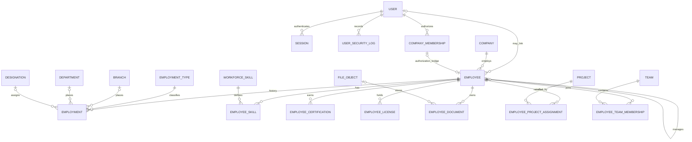

# Workforce & Identity Management

## Purpose and boundaries

This module is the source of truth for people, current workforce placement, employment history, skills, credentials, documents, reporting relationships, availability, and project assignments.

Authentication and employment are deliberately separate:

- `User` authenticates and owns password, MFA state, sessions, refresh tokens, account status, last login, and security events.
- `Employee` represents a person in a company workforce. An employee can exist without login access.
- `Employment` records effective-dated placement and preserves branch, department, designation, manager, and employment-type history.
- `CompanyMembership` remains the authorization bridge for existing role and permission infrastructure. It is optional on an employee.
- New workforce and project-assignment records use `employeeId`, not `userId`.

Attendance, payroll, leave, recruitment, and performance reviews are outside this module. The dashboard exposes no fabricated data for those future domains.

## Architecture

The NestJS implementation follows the existing clean-architecture structure:

```text
presentation/workforce.controller.ts
            ↓
application/workforce.service.ts
            ↓
domain/workforce.repository.ts
            ↓
infrastructure/prisma-workforce.repository.ts
            ↓
PostgreSQL / Prisma
```

The service owns tenant isolation, date rules, reporting-cycle prevention, allocation rules, and command intent. The repository owns persistence, atomic compatibility synchronization, and audit writes.

## Entity relationship diagram



## Database schema and invariants

The schema is introduced by `prisma/migrations/20260818143727_workforce_identity/migration.sql`.

Important invariants:

- Employee code is unique per company.
- National ID is unique per company when present.
- A user and membership can each link to at most one employee per company.
- Every employment record has a required employment type and effective-from date.
- Current organization fields on `Employee` are a denormalized read model; `Employment` is the historical record.
- Employee skill is unique per employee and skill and can be reactivated after soft deletion.
- Project assignment is unique per employee, project, and role and uses a bounded percentage.
- All business entities are company-scoped and use soft deletion.
- File references are accepted only when the file belongs to the same company.
- Manager assignment rejects self-management and transitive cycles.
- Active overlapping project allocations cannot exceed 100%.
- Personal-data updates use `expectedUpdatedAt` for optimistic concurrency.

System employment types are Permanent, Contract, Daily Wage, Hourly, Consultant, Intern, Subcontractor, and Temporary. System skills cover Civil, Electrical, Mechanical, Plumbing, Planning, Quantity Surveying, Procurement, Accounting, Safety, Quality, and Administration. Company-specific catalog entries can be added without schema changes.

## API

All endpoints are versioned under `/api/v1/companies/{companyId}/workforce`. Swagger metadata is available through the existing `/api/docs` endpoint.

| Method       | Path                                               | Permission                        | Purpose                                                    |
| ------------ | -------------------------------------------------- | --------------------------------- | ---------------------------------------------------------- |
| GET          | `/employees`                                       | `Employee.View`                   | Paginated search and filters                               |
| POST         | `/employees`                                       | `Employee.Create`                 | Create employee and initial employment                     |
| GET          | `/employees/{employeeId}`                          | `Employee.View`                   | Full employee profile and history                          |
| PATCH        | `/employees/{employeeId}`                          | `Employee.Edit`                   | Personal/contact/status update with optimistic concurrency |
| DELETE       | `/employees/{employeeId}`                          | `Employee.Delete`                 | Archive workforce record                                   |
| GET          | `/employees/{employeeId}/dashboard`                | `Employee.View`                   | Current placement, projects, manager, and expiries         |
| POST         | `/employees/{employeeId}/transfer`                 | `Employee.Transfer`               | Effective-dated placement or manager change                |
| POST         | `/employees/{employeeId}/project-assignments`      | `Employee.AssignProject`          | Assign employee to project                                 |
| DELETE       | `/employees/{employeeId}/project-assignments/{id}` | `Employee.AssignProject`          | End project assignment                                     |
| POST         | `/employees/{employeeId}/skills`                   | `Employee.Edit`                   | Add or update proficiency                                  |
| DELETE       | `/employees/{employeeId}/skills/{skillId}`         | `Employee.Edit`                   | Remove skill                                               |
| POST         | `/employees/{employeeId}/certifications`           | `Employee.Edit`                   | Add certification and optional file                        |
| PATCH/DELETE | `/employees/{employeeId}/certifications/{id}`      | `Employee.Edit`                   | Update or remove certification                             |
| POST         | `/employees/{employeeId}/licenses`                 | `Employee.Edit`                   | Add license and optional file                              |
| PATCH/DELETE | `/employees/{employeeId}/licenses/{id}`            | `Employee.Edit`                   | Update or remove license                                   |
| POST         | `/employees/{employeeId}/documents`                | `Employee.Documents`              | Add employee document metadata and optional file           |
| PATCH/DELETE | `/employees/{employeeId}/documents/{id}`           | `Employee.Documents`              | Update or remove document metadata                         |
| GET          | `/organization-chart`                              | `Employee.View`                   | Current employee reporting graph                           |
| GET/POST     | `/catalog/employment-types`                        | `Employee.View` / `Employee.Edit` | Employment-type catalog                                    |
| GET/POST     | `/catalog/skills`                                  | `Employee.View` / `Employee.Edit` | Skills catalog                                             |

Employee search supports code, first/middle/last name, phone, personal/company email, department, designation, skill, project, status, availability, and explicit branch/department/designation/skill/project filters.

## Transactions and compatibility

Create, transfer, archive, project assignment, skill changes, and credential/document creation are transactional with their audit record.

A transfer performs the following as one operation:

1. Ends the current active `Employment` on the day before the new effective date.
2. Creates the next active employment snapshot.
3. Updates the employee current-placement read model.
4. Synchronizes the optional `CompanyMembership` placement used by existing modules.
5. Ends the previous primary `ReportingLine` and creates the new one when both employees have memberships.
6. Records old/new state and the reason in the audit log.

This bridge preserves existing project and permission behavior while new modules migrate to employee IDs.

## RBAC and audit

Permissions seeded by this module:

- `Employee.View`
- `Employee.Create`
- `Employee.Edit`
- `Employee.Delete`
- `Employee.Documents`
- `Employee.AssignProject`
- `Employee.Transfer`
- `Employee.Export`

HR receives the full employee permission set. Project Manager receives employee viewing and project-assignment permissions. Company and platform administrators inherit all seeded permissions through the existing role model.

Audit actions include employee create/update/archive, transfer, project assignment/unassignment, skill assignment/removal, certification, license, and document changes. Request ID, actor, company, IP, user agent, old value, and new value flow through the existing audit service. Sensitive values are redacted by that service.

Authentication now records successful logins, known-user login failures, token refreshes, and logout events in `UserSecurityLog`; successful login also updates `User.lastLoginAt`.

## UI

Routes:

- `/companies/{companyId}/employees` — searchable employee directory
- `/companies/{companyId}/employees/new` — initial employee/employment form
- `/companies/{companyId}/employees/{employeeId}` — employee profile and dashboard
- `/companies/{companyId}/employees/{employeeId}/edit` — personal/contact editor
- `/companies/{companyId}/workforce/organization-chart` — employee reporting chart

The profile contains Overview, Assignments, Skills, Certifications, Licenses, Documents, and Employment History tabs. Organization changes are isolated in the Transfer workflow so history cannot be bypassed by a general profile patch.

## Testing

- `workforce.service.spec.ts` covers tenant isolation, cross-company references, chronology, transfer-only placement changes, self/cyclic reporting, project allocation, and valid creation.
- `workforce.dto.spec.ts` covers validation and query transformation.
- `workforce.e2e-spec.ts` exercises the HTTP route, response envelope, pagination, and request validation with the application pipe/interceptor stack.
- Prisma migration validation and production API/web builds are part of release verification.

For database-backed CI, run migrations against an isolated PostgreSQL database before the e2e suite. Never point destructive integration setup at a shared development or production database.

## Future extensions

- Attendance, leave, payroll, recruitment, performance, tasks, and announcements should reference `Employee.id` and add their own bounded contexts.
- Approval chains should add effective-dated chain definitions rather than overloading the single primary manager.
- Certification/document expiry notifications should consume the existing expiry indexes and notification module through scheduled workers.
- MFA fields are stored on `User`; enrollment and challenge flows should remain in the authentication bounded context.
- Existing membership-based project team/task foreign keys can be migrated incrementally by adding employee foreign keys, backfilling through `Employee.membershipId`, switching readers, and only then retiring legacy columns.
- Data export should stream a permission-filtered projection and log `Employee.Exported`; the permission is seeded now for that future endpoint.
